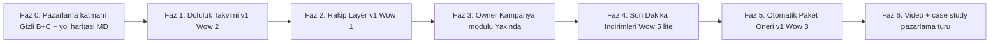

# Panobu Wow Features Yol Haritası

> Canlı belge. Her faz canlıya alındıktan sonra "Canlıya alındı" bloğu doldurulur (Ne eklendi / Neden önemli / Nasıl pazarlanacak / Video brief / Ölçüm).

## Vizyon (bir paragraf)

Panobu, Türkiye'nin "hissiyat + ajans tavsiyesi + rakibin tekrarı" ile yönetilen 11 milyar ₺'lik outdoor pazarını **veri + şeffaflık + self-serve** ile yeniden kuruyor. AdQuick 2015 ABD'sinde ne yaptıysa, Panobu 2026 Türkiye'sinde onu yerel dinamiklere (AVM kültürü, D-yolları, yerel markalar) uyarlıyor. İlk fan kitlesi büyük CMO'lar değil; veri bilinçli D2C, KOBİ, startup ve performance marketer'lar.

## Öncelik Sırası

Sıra mantığı:

1. **Güven riski en kritik**: Müsait olmayan pano sepete eklenirse marketplace'in güveni yara alır → Takvim ilk.
2. **Veri biriktirmesi 3-4 ay sürecek**: Rakip haritası ancak siparişler birikince değerli olacak → mümkün olan en erken başlat.
3. **Ekosistem beslenmeli**: Owner'lar da pazarlama yapabilsin → Kampanya modülünün "Yakında" preview'u.
4. **Envanter döngüsü**: Son Dakika İndirimleri boş panoları hareket ettirir.
5. **En güçlü satış aracı**: Paket Öneri; ama en uzun iş, sona.
6. **Cilalama**: Canlı videolarla vitrini parlat.

---

## FAZ 0 — Pazarlama katmanı (Gizli Wow B + C + yol haritası iskeleti)

### Amaç
Panobu'nun **zaten sahip olduğu ama görünürlüğü zayıf** iki wow'u öne çıkarmak:
- **Gizli Wow B**: Self-serve outdoor rezervasyonu (30 dakikada, ajans komisyonsuz).
- **Gizli Wow C**: Medya sahipleri için platform + storefront + inquiry yönetimi.

### Kapsam
- `docs/panobu_wow_features_roadmap.md` — bu dosya (tüm fazlar iskelet).
- `src/app/markalar-icin/page.tsx` — Gizli Wow B landing.
- `src/app/medya-sahipleri-icin/page.tsx` — Gizli Wow C landing.
- `src/messages/publicNav.ts` — `forBrands`, `forOwners` yeni nav key'leri (TR/EN).
- `src/components/PublicLayout.tsx` — Üst nav + mobil menüye 2 yeni link.
- `src/app/page.tsx` — DataDrivenBanner altına "Kimler için?" iki kartlı bölüm + anasayfa header'ına 2 yeni link.

### Ünite sahibi paneli etkisi
Yok.

### Admin paneli etkisi
Yok.

### Müşteri tarafı etkisi
- Üst menüde `Markalar İçin` + `Medya Sahipleri` linkleri.
- Anasayfada DataDrivenBanner altı "Kimler için?" 2 kart.
- İki yeni detaylı landing sayfası.

### Video brief'leri

**V0.1 — "Panobu: 30 dakikada outdoor rezervasyon"** (süre 75-90 sn)
- **Format**: Ekran kaydı + voice-over (siz kendi sesinizle anlatın).
- **Script akışı**:
    1. Açılış (5 sn): "Türkiye'de bir pano kiralamak normalde 2 hafta alır. Şimdi izleyin."
    2. `/static-billboards` açılır, Kocaeli filtrelenir (8 sn).
    3. Haritadan bir pano seçilir, skor + çevre analizi + tahmini gösterim görünür (15 sn): "Her panoda skor, çevre markaları, tahmini gösterim."
    4. Sepete atılır, tarih seçilir (10 sn).
    5. Ödeme ekranı, kart yazılır (10 sn).
    6. "Rezervasyon oluşturuldu" özeti (8 sn).
    7. Kapanış (15 sn): "Panobu, Türkiye'de outdoor reklamcılığını dijital reklam kadar hızlı ve şeffaf yaptı." + CTA.
- **Ne gösterilmemeli**: Admin paneli, backend, formül.
- **Kullanılacak yerler**: `/markalar-icin` hero, anasayfa Gizli Wow B kartı hover.

**V0.2 — "Medya sahipleri için Panobu nedir?"** (süre 45-60 sn)
- **Format**: Ekran kaydı + basit grafikler.
- **Script akışı**:
    1. "Panolarınızı satmak için ajansa komisyon mu veriyorsunuz?" (5 sn).
    2. Owner dashboard'u açılır → panolar, siparişler, raporlar (15 sn).
    3. Public storefront `/medya/[slug]` gösterilir: "İşte sizin Panobu vitriniz" (10 sn).
    4. Inquiry ekranı + haftalık istatistik raporu (10 sn).
    5. Yakında: "Kampanya modülü ile müşterilerinize mail/SMS" (5 sn).
    6. Kapanış + CTA (10 sn): "Hemen başvurun, vitrininizi açın."
- **Kullanılacak yerler**: `/medya-sahipleri-icin` hero, anasayfa Gizli Wow C kartı.

### Nasıl pazarlanacak
- LinkedIn (B2B ajans + CMO): V0.2 + "Panobu medya sahipleri için dönüşüm aracı" post.
- Instagram (marka + KOBİ): V0.1 + "30 dakikada outdoor kampanya" story/reel.
- E-posta imza + Calendly linki: Yeni sayfalara direkt link.
- Blog: "Neden Panobu" post güncellemesi — V0.1/V0.2 embed.

### Ölçüm
- `/markalar-icin` + `/medya-sahipleri-icin` aylık tekil ziyaretçi.
- Bu sayfalardan `/static-billboards` ve `/auth/register` dönüşüm oranı.
- Kayıt olan medya sahibi sayısı (owner onboarding funnel'da yeni kaynak etiketi: `source=landing-owner`).

### Canlıya alındı — Ne eklendi / Neden önemli / Ölçüm

**Ne eklendi**
- [docs/panobu_wow_features_roadmap.md](docs/panobu_wow_features_roadmap.md) tüm fazları listeleyen bu canlı belge.
- [src/app/markalar-icin/page.tsx](src/app/markalar-icin/page.tsx) — "30 dakikada rezervasyon" + platform özellikleri (raporlama, şeffaflık, çevre analizi, CPM kıyası) içeren marka landing.
- [src/app/medya-sahipleri-icin/page.tsx](src/app/medya-sahipleri-icin/page.tsx) — owner değer önermesi, storefront, inquiry yönetimi, gelecek kampanya modülü, hesap açma çağrısı.
- Üst navigasyon: [src/components/PublicLayout.tsx](src/components/PublicLayout.tsx) + [src/app/page.tsx](src/app/page.tsx) header'a "Markalar İçin" + "Medya Sahipleri" linkleri (mobil menü dahil).
- Anasayfa DataDrivenBanner altına "Kimler için?" 2 kartlı bölüm.
- [src/messages/publicNav.ts](src/messages/publicNav.ts) TR/EN yeni nav key'leri.

**Neden önemli**
Panobu'nun bugün zaten sahip olduğu iki güçlü ama görünmeyen yetkinliği (self-serve hız + owner storefront/dashboard) **anasayfadan tek tıkla erişilebilir** yaptık. Yatırımcı / ajans / medya sahibi ziyaretinde doğru mesajın doğru kişiye gitmesini sağlıyor.

**Nasıl pazarlanacak**
- Sosyal medya postları V0.1 ve V0.2 videoları hazır olunca.
- Calendly/e-posta imzalarına link ekle.
- LinkedIn outreach mesajlarında: "Panobu medya sahipleri için ne yapıyor, bir bak: panobu.com/medya-sahipleri-icin" kısa linki.

**Ölçüm**
İlk 30 gün hedefleri:
- `/markalar-icin` → 500+ tekil ziyaret, %6+ `/static-billboards` dönüşümü.
- `/medya-sahipleri-icin` → 200+ tekil ziyaret, 10+ yeni owner kayıt başvurusu.

---

## FAZ 1 — Wow 2 · Doluluk Takvimi v1 (en kritik güven katmanı)

### Amaç
Sepete eklenen panonun gerçekten müsait olup olmadığını baştan göstermek, iptal ve güven kaybını kesmek.

### Kapsam

**Veri modeli**
- `PanelAvailabilityBlock` tablosu: `panelId`, `startDate`, `endDate`, `source` enum ("ORDER" | "MANUAL" | "RENTAL" | "EXTERNAL"), `bookedBrand?`, `campaignName?`, `createdBy?`, `note?`.
- Mevcut `StaticRental` + `Order.startDate/endDate` + `StaticPanel.blockedDates` birleştirilerek tek "availability view" API.

**API**
- `GET /api/panels/[id]/availability?from=&to=` — bloklu tarih aralıkları.
- `POST /api/admin/panels/[id]/availability` — admin manuel blok.
- `PATCH /api/admin/panels/[id]/availability/[blockId]` / `DELETE`.
- Sipariş oluşunca otomatik `PanelAvailabilityBlock` (source=ORDER).

**Müşteri tarafı UX**
- Pano kartında mini tarih şeridi (haritada hover + liste görünümünde).
- Pano detay sayfasında 6 aylık tam takvim (yeşil/kırmızı/gri).
- Global filtre: "Şu tarih aralığında boş olanlar".
- Sepette dolu tarih tespiti + "en yakın boş tarih" alternatif önerisi.

**Admin tarafı**
- Admin panelinde satır başı "Müsaitlik" butonu + modal: tarih + marka + toplu uygulama.
- Yeni sayfa: `src/app/app/admin/availability/page.tsx` — haftalık takvim view (tüm panolar yan yana, ajans telefonu sonrası hızlı işaretleme).

**Ünite sahibi tarafı**
- `src/app/app/owner/units/[id]/page.tsx` üzerinde "Müsaitlik" sekmesi.

### Video
**V1.1 — "Hangi pano ne zaman boş?"** (45 sn)
- Hangi panonun hangi hafta boş olduğunu gösteren takvim; tarih filtresiyle müsaitlik taraması; sepete dolu pano eklendiğinde alternatif önerisi.

### Canlıya alındı
_TODO — Faz 1 bittiğinde doldurulacak._

---

## FAZ 2 — Wow 1 · Rakip Layer v1

### Amaç
Markanın "rakibi şu an kaç panoda" sorusuna cevap veren interaktif harita katmanı. Veri network-effect'i bugünden başlasın.

### Kapsam

**Veri modeli**
- `Order` + `OrderItem`'a: `campaignBrand` (string) + `brandCategory` enum (FAST_FOOD, BANK, TELECOM, ECOMMERCE, AUTOMOTIVE, FASHION, RETAIL, FOOD_BEVERAGE, OTHER).
- `PanelActiveBrand` tablosu: admin'in ajans telefonunda "şu an bu panoda Coca-Cola var" bilgisini tutar.

**API**
- `GET /api/competitor/heatmap?category=&city=&district=`.
- `GET /api/competitor/brands`.

**Müşteri tarafı UX**
- Harita üstünde toggle: "Aktif Kampanyalar".
- Kategori filtresi + marka seçimi.
- Pano detay sayfasında "rakipler bu çevrede" widget'ı.
- Marka kıyaslama: "Domino's 12 panoda, sen 0".

**Admin tarafı**
- Sipariş formuna `campaignBrand` + kategori zorunlu.
- Yeni sayfa: `src/app/app/admin/competitor-feed/page.tsx` — VA için hızlı marka-pano eşleme.

**Ünite sahibi tarafı**
- Kendi panolarında aktif markalar istatistiği (read-only).
- Sipariş aldıklarında çağrı formunda marka/kategori zorunlu.

### Video
**V2.1 — "Rakibinizi haritada görün"** (60 sn).

### Canlıya alındı
_TODO — Faz 2 bittiğinde doldurulacak._

---

## FAZ 3 — Owner "Kampanyalar — Yakında"

### Amaç
Medya sahiplerine ileride e-posta + SMS kampanya yönetimi sunacağımızı vitrine koymak; bugünden owner ekosisteminin sadakatini artırmak.

### Kapsam
- `src/app/app/owner/OwnerShell.tsx` → `navItems`'e "Kampanyalar" maddesi + "Yakında" rozeti.
- Yeni route: `src/app/app/owner/campaigns/page.tsx` — sadece statik preview (placeholder).
    - Üst banner: "Panobu Kampanyalar — Müşterilerinize hızlıca mail ve SMS yollayın."
    - 2 sekme: Mail Kampanyaları / SMS Kampanyaları.
    - Tüm butonlar disabled + tooltip.
    - Placeholder örnekler (3 satır, disabled).
    - Waitlist formu: "Beta'ya ilk sen gir" (e-posta kaydeder, ileride aktive ederiz).

### Video
**V3.1 — "Pano sahipleri için Panobu"** (45 sn, V0.2 ile birlikte pazarlanabilir).

### Canlıya alındı
_TODO — Faz 3 bittiğinde doldurulacak._

---

## FAZ 4 — Wow 5 hafif · Son Dakika İndirimleri

### Amaç
Boş panoları 48-72 saat içinde kurtarmak; Booking.com mantığını OOH'a getirmek.

### Kapsam

**Veri modeli**
- `StaticPanel`: `lastMinuteDiscount?` (int %), `lastMinuteDiscountStartsAt?`, `lastMinuteDiscountExpiresAt?`, `lastMinuteNote?`.

**Admin tarafı**
- Panoya tek tık "Son Dakika İndirimi Ekle" modal.
- Toplu işlem.
- Otomatik öneri: "Önümüzdeki 10 gün rezervasyonu yok olan X pano" → "Tümüne %20" tek tık.

**Ünite sahibi tarafı**
- Kendi panolarında "Son Dakika İndirimi" switch.

**Müşteri tarafı UX**
- Yeni sayfa: `src/app/son-dakika/page.tsx` — liste + sayaç.
- Anasayfada "Bugün Son Fırsatlar" carousel.
- Pano kartlarında kırmızı rozet.
- Üst menüde süreli "Son Dakika" link.

### Video
**V4.1 — "Son dakika fırsatları"** (30 sn).

### Canlıya alındı
_TODO — Faz 4 bittiğinde doldurulacak._

---

## FAZ 5 — Wow 3 · Otomatik Paket Öneri v1

### Amaç
Medya planörünün 3 günde yaptığı işi 30 saniyede yapmak. Panobu'nun en güçlü satış aracı.

### Kapsam

**Müşteri tarafı**
- Yeni sayfa: `src/app/butce-planlayici/page.tsx`.
- Form: bütçe + şehir(ler) + tarih + kategori.
- 3 paket sunumu: Verimli / Dengeli / Premium.
- Her paket: harita, skor, tahmini gösterim, CPM, çevre uyum %, risk notları, "Sepete ekle".
- "Paketi düzenle" — canlı metrikler.

**Admin tarafı**
- Parametre dashboard'u (kategori ağırlıkları, coğrafi çeşitlilik kısıtları).
- Admin kendi paketini oluşturup müşteriye gönderebilsin (kendi paket builder'ı).

**Ünite sahibi tarafı**: Yok (v1).

### Video
**V5.1 — "30 saniyede kampanya"** (90 sn, yatırımcı pitch'inin merkez videosu).

### Canlıya alındı
_TODO — Faz 5 bittiğinde doldurulacak._

---

## FAZ 6 — Pazarlama turu

### Amaç
Canlıdaki wow feature'lara ait videoları gömerek, ilk case study'yi yayınlayarak, blog/updates duyuruları yaparak vitrini parlatmak.

### Kapsam
- YouTube videoları landing sayfalarına embed.
- İlk case study: `/case-study/[slug]`.
- `/blog` + `/updates` sayfalarına duyurular.
- OG image + metadata güncelleme.

### Canlıya alındı
_TODO — Faz 6 bittiğinde doldurulacak._

---

## Ek A — Yatırımcı Pitch Cümleleri (Faz sonrası güncellenecek)

- "Türkiye OOH = 11 milyar ₺; veri yok, standart yok, self-serve yok. Panobu bu 3'ünü getiriyor."
- "Pano detayında skor + çevre analizi + CPM + rakip haritası — dünyada AdQuick, Türkiye'de Panobu."
- "Büyük CMO'lara değil, D2C/startup/KOBİ'ye satıyoruz. AdQuick'in 2015-2018 yolculuğu."
- "Her rezervasyon rakip haritamızı büyütüyor. Marketplace network-effect'i OOH'a ilk kez geldi."

---

## Ek B — Video & YouTube Entegrasyon Checklist'i

| # | Video | Süre | Kayıt Durumu | YouTube Link | Gömülecek Sayfalar |
|---|---|---|---|---|---|
| V0.1 | Panobu: 30 dakikada outdoor rezervasyon | 75-90 sn | Bekliyor | — | `/markalar-icin`, anasayfa |
| V0.2 | Medya sahipleri için Panobu nedir? | 45-60 sn | Bekliyor | — | `/medya-sahipleri-icin`, anasayfa |
| V1.1 | Hangi pano ne zaman boş? | 45 sn | Faz 1 sonrası | — | Pano detay, `/static-billboards` |
| V2.1 | Rakibinizi haritada görün | 60 sn | Faz 2 sonrası | — | `/markalar-icin`, harita |
| V3.1 | Pano sahipleri için Panobu | 45 sn | V0.2 ile aynı | — | `/medya-sahipleri-icin` |
| V4.1 | Son dakika fırsatları | 30 sn | Faz 4 sonrası | — | `/son-dakika` |
| V5.1 | 30 saniyede kampanya | 90 sn | Faz 5 sonrası | — | `/butce-planlayici`, yatırımcı pitch |

### Video çekim ipuçları (hepsi için)
- **Ekran kaydı**: 1920×1080, 30 fps, hızlandırılmış 1.2x makul hızla.
- **Voice-over**: Sakin, güven veren, "ajans-alternatifi-değil-modernleşmesi" tonu.
- **Alt yazı**: Hem TR hem EN (YouTube otomatik jenerik + elle düzelt).
- **Kapak fotoğrafı (thumbnail)**: Panobu logosu + ekran görüntüsü + tek kelimelik başlık ("HIZ", "ŞEFFAFLIK", "VERİ").
- **YouTube ayarları**: Public, kategori "Science & Technology", açıklamaya `panobu.com/markalar-icin` gibi ilgili URL.

---

## Revizyon Geçmişi

- **2026-04-16**: Faz 0 başlatıldı, MD iskeleti oluşturuldu.
